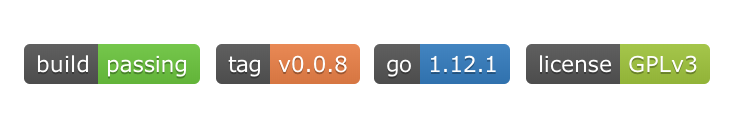
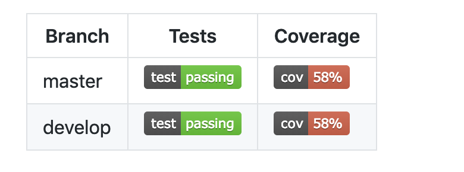

# 模板

- [模板](#模板)
    - [1 项目名称](#1-项目名称)
    - [2 徽章](#2-徽章)
    - [3 测试](#3-测试)
    - [4 项目简介](#4-项目简介)
    - [5 重要内容 **(通用部分)**](#5-重要内容-通用部分)
    - [6 文档](#6-文档)
        - [6.1 website **(通用部分)**](#61-website-通用部分)
        - [6.2 Install](#62-install)
        - [6.3 Quick Start](#63-quick-start)
    - [7 贡献 **(通用部分)**](#7-贡献-通用部分)
    - [8 资源 **(通用部分)**](#8-资源-通用部分)

## 1 项目名称

代码示例

```markdown
# Tendermint
```

## 2 徽章

例如



代码示例

```markdown

[](https://github.com/trias-lab/gondwana/releases/tag/v0.0.8)
[](https://github.com/moovweb/gvm)
[](https://github.com/trias-lab/gondwana/blob/master/LICENSE)
```

## 3 测试

例如



代码示例

```markdown
| Branch  |                                 Tests                                 |                              Coverage                               |
| ------- | --------------------------------------------------------------------- | ------------------------------------------------------------------- |
| master  |  |   |
| develop |  |  |
```

## 4 项目简介

## 5 重要内容 **(通用部分)**

```markdown
## A Note on Production Readiness

While Trias is being used in production in private, permissioned
environments, we are still working actively to harden and audit it in preparation
for use in public blockchains.
We are also still making breaking changes to the protocol and the APIs.
Thus, we tag the releases as *alpha software*.

In any case, if you intend to run Trias in production,
please [contact us](mailto:contact@trias.one) and [join the chat](https://www.trias.one).

## Security

To report a security vulnerability,  [bug report](mailto:contact@trias.one)
```

## 6 文档 

### 6.1 website **(通用部分)**

```markdown
## Documentation

Complete documentation can be found on the [website](https://github.com/trias-lab/Documentation).
```

### 6.2 Install

```markdown
### Install

此处是说明或文档链接
```

### 6.3 Quick Start

```markdown

### Quick Start

此处是说明或文档链接
```

## 7 贡献 **(通用部分)**

```markdown
## Contributing

All code contributions and document maintenance are temporarily responsible for TriasLab

Trias are now developing at a high speed and we are looking forward to working with quality partners who are interested in Trias. If you want to join.Please contact us:
- [Telegram](https://t.me/triaslab)
- [Medium](https://medium.com/@Triaslab)
- [BiYong](https://0.plus/#/triaslab)
- [Twitter](https://twitter.com/triaslab)
- [Gitbub](https://github.com/trias-lab/Documentation)
- [Reddit](https://www.reddit.com/r/Trias_Lab)
- [More](https://www.trias.one/)
- [Email](mailto:contact@trias.one)


### Upgrades

Trias is responsible for the code and documentation upgrades for all Trias modules.
In an effort to avoid accumulating technical debt prior to Beta,
we do not guarantee that data breaking changes (ie. bumps in the MINOR version)
will work with existing Trias blockchains. In these cases you will
have to start a new blockchain, or write something custom to get the old data into the new chain.
```

## 8 资源 **(通用部分)**

```markdown
## Resources

### Research

* [The latest paper](https://www.contact@trias.one/attachment/Trias-whitepaper%20attachments.zip)
* [Project process](https://trias.one/updates/project)
* [Original Whitepaper](https://trias.one/whitepaper)
* [News room](https://trias.one/updates/recent)
```