# README 的道术

**以 TM 为例**

## 1 项目名称

*图 1-1*

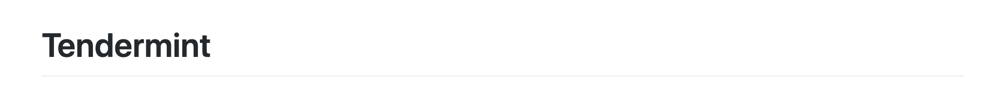

## 2 相关重要概念的解释

### 2.1 道

*图 1-2*

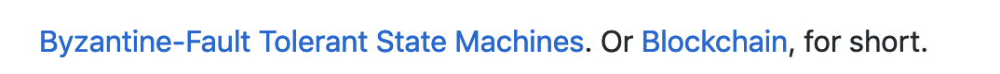


*图 1-2* 中 `Byzantine-Fault Tolerant` `State Machines` `Blockchain` 这几个 TM 中涉及到的重要概念都直接链接到了 wiki

### 2.2 术

markdown 链接

*代码 1-1*

```markdown
[Byzantine-Fault Tolerant](https://en.wikipedia.org/wiki/Byzantine_fault_tolerance)
```

*图 1-3*

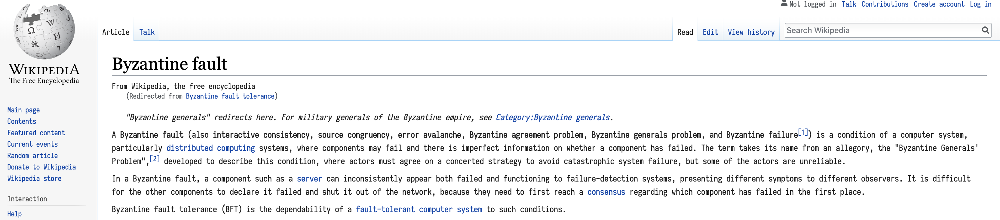

*图 1-3* 显示了 **拜占庭容错 的 wiki**

## 3 Badge

### 3.1 道

*图 1-4*

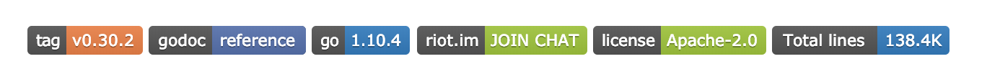

*图 1-4* 中有若干标签，这些标签简明扼要的给出了一些信息。版本，文档，语言，论坛，许可证，代码。其他的项目也可能别的标签，比如编译。

### 3.2 术

*代码 1-2*

```markdown
[](https://github.com/moovweb/gvm)
```

*代码 1-2* 给出了  的实现方式，是 **链接嵌套图片**。

1. 链接的地址是 **gvm** 项目 (一个允许多个不同版本的 golang 同时存在，能自由切换的工具)，显示的是一个 **svg** 图片

2. **svg** 图片的生成多使用 [shields.io](https://shields.io/)

#### 3.2.1 shields.io 的简单使用

`https://img.shields.io/badge/` 后面跟 **name**-**value**-**color**.svg

**不用事先生成，可直接使用**

## 4 测试情况

### 4.1 道

*图 1-5*

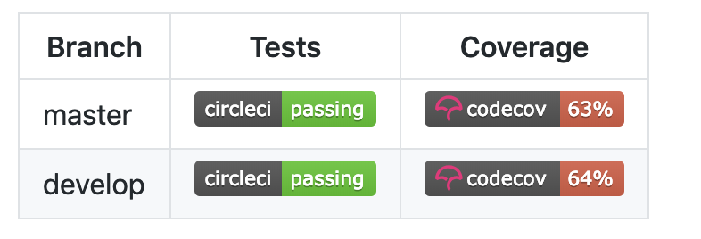


*图 1-5* 给出了不同分支的测试及覆盖率情况

### 4.2 术

1. 表格嵌套 Badge
2. 使用了 [circleci](https://circleci.com), [codecov](https://codecov.io/) 两个工具，**具体使用方式现在不明，有待研究**

## 5 概要描述

### 5.1 道

*图 1-6*

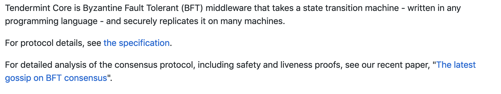

*图 1-6* 对项目进行简短的描述

### 5.2 术

1. 几句话说出 **这个项目是什么**
2. 相关的重要概念或内容可以给出链接

## 6 插入的重要说明

### 6.1 道

*图 1-7*

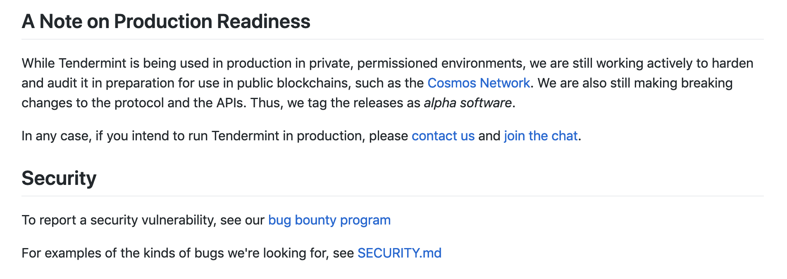

*图 1-7*  中的两个说明应该是 TM 项目比较重视的两点，不具有共性。

### 6.2 术

根据项目特点，把比较重要的，想要强调的部分放在靠前的位置。

## 7 项目依赖

### 7.1 道

*图 1-8*

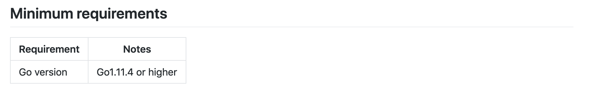

*图 1-8* 给出了项目的依赖，让读者可以明确项目使用的 环境，语言，库 及其版本的信息。

### 7.2 术

表格的方式给出

## 8 文档

### 8.1 道

*图 1-9*

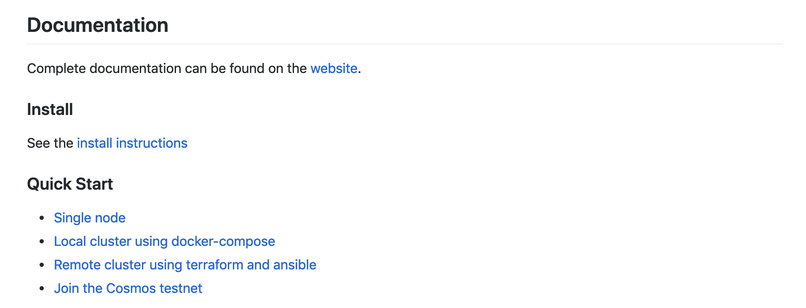

*图 1-9* 给出了文档的相关信息。这里是读者了解项目最重要的地方。它分成了三个部分:

1. website 是完整文档

2. Install 给出安装说明

3. Quick Start 给出了使用示例

### 8.1 术

#### 8.1.1 website

TM 的这个 website 是用 [VuePress](https://vuepress.vuejs.org/) 做的，把 markdown 文档编译成了静态网站，这一点跟 [MkDocs](https://www.mkdocs.org/) 很像。[Github Pages](https://pages.github.com/) 是 github 提供的一种展示文档的方式，可以把编译好的静态网站宿主在上面，但是要求 **项目必须是 public 的**

展示大量信息的另一种方式是 github 的 **wiki**，wiki 跟项目不在同一个 repository，需要单独维护。跟 website 相比，readme, wiki 的缺点是 **只支持最基本的 markdown 语法**，而 website，比如 MkDocs 就支持插件，如 mermaid，plantuml, admonition 等一系列插件，更方便文档的维护，也使得文档的表现力更强。

*图 1-10*

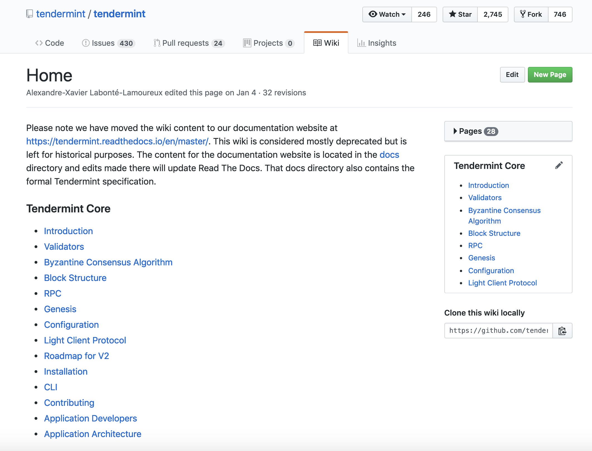

*图 1-10* 是 TM 的 wiki

*图 1-11*

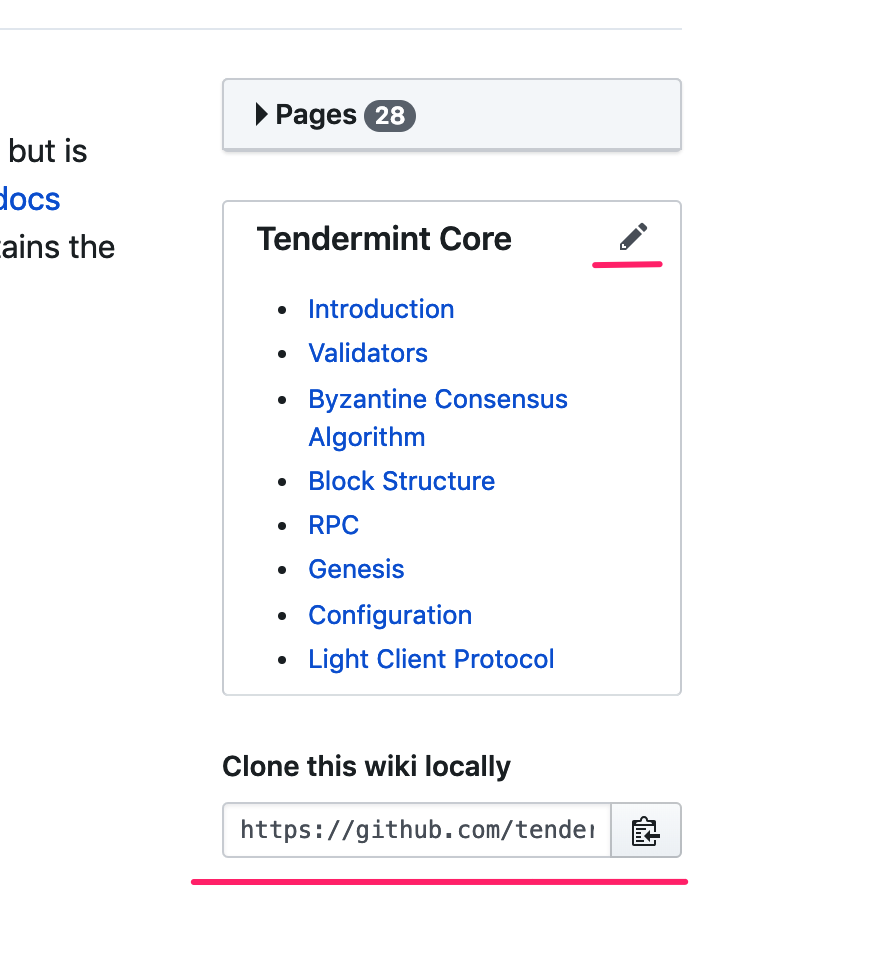

*图 1-11* 显示了 wiki 可以 **在线编辑**，也可以 **本地编辑**

从地址 `https://github.com/tendermint/tendermint.wiki.git` 可看出 wiki 与 TM 项目分属于不同 repository

!!! note "wiki 与 website 的区别"
    1. wiki 中的流程图，时序图，干特图 只能放图片，如果有改动，只能重新结截图; website 的各种图由插件生成，有专门的 markdown 语法，修改起来方便

    2. wiki 样式相对固定; website 的样式相对灵活

    3. wiki 简单易用; website 门槛略高，需要学习工具的使用。

#### 8.1.2 Install

Install instructions 链接到了另一个文件， 里面介绍了: **如何安装**，**如何运行**，**如何重装** 等信息。文内有相关说明及示例代码。

#### 8.1.3 Quick Start

Quick Start 给出了 4 个链接，指向了 4 个不同位置。前 3 个指向了文件，最后一个指向了 Cosmos 的文档。

## 9 贡献

*图 1-12*

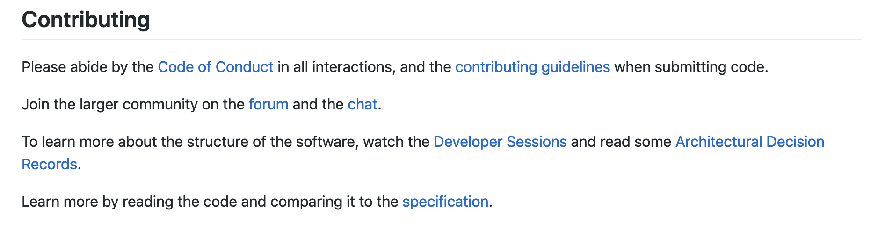

*图 1-12* 主要是介绍如何参与项目。这一段虽短，但给出了多个链接:

1. Code of Conduct 是行为规范

2. contributing guidelines 是参与流程

3. forum 和 chat 是贡献者之前的沟通方式

4. Develper Sessions 是放到 youtube 上的视频 (没看内容)

5. Architetural Decision Records 是架构设计

6. specification 是整个代码结构说明

## 10 版本

*图 1-13*

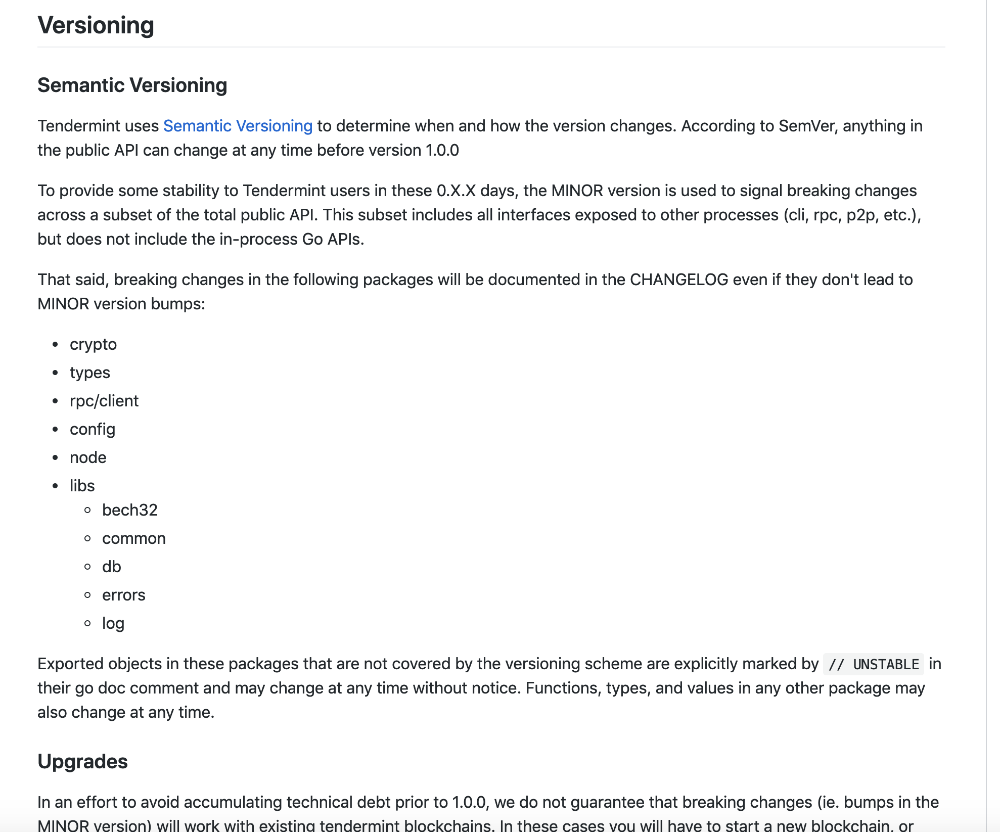

*图 1-13* 给出了项目更新与版本号的关系。TM 像很多项目一样，也使用了 [Semantic Versioning](https://semver.org/)

打开链接，可以看到

*图 1-14*

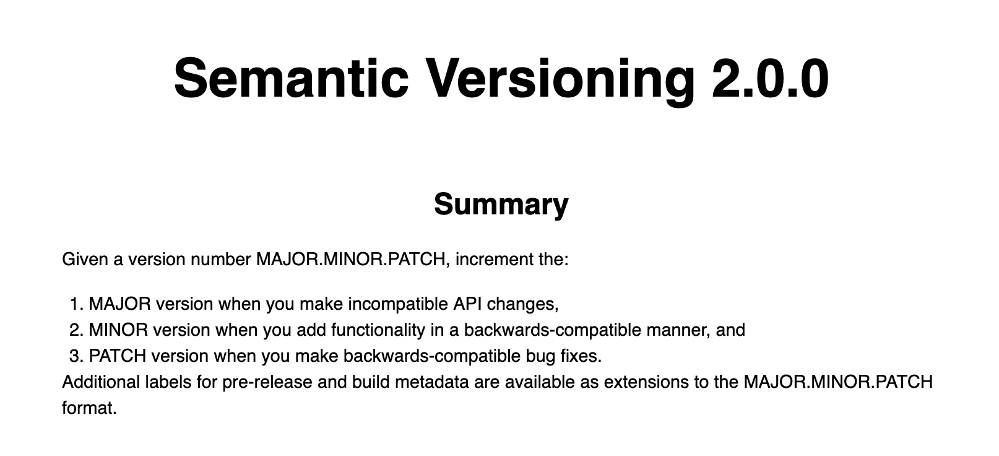

*图 1-14* 给出了版本号定义的基本规则

## 11 资源

*图 1-15*

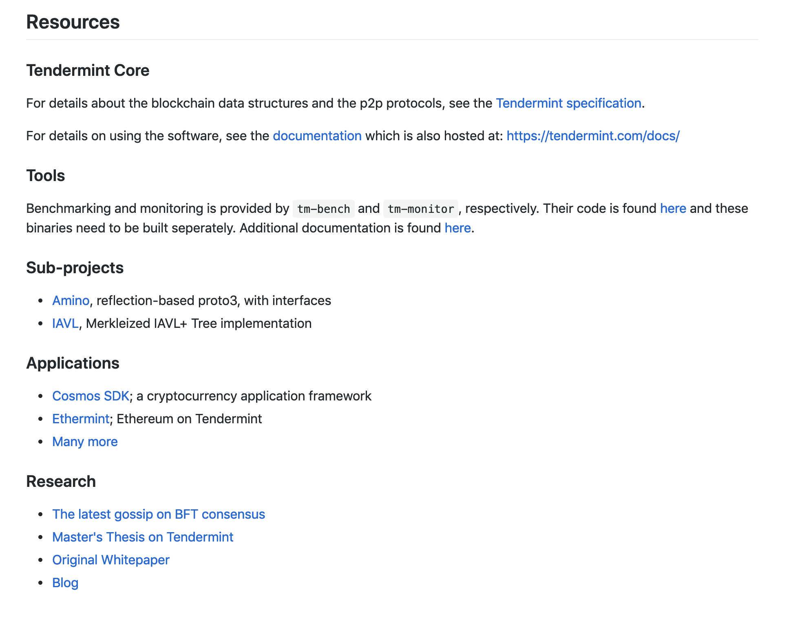

*图 1-15* 给出了其他相关的一些信息。算是一些补充。